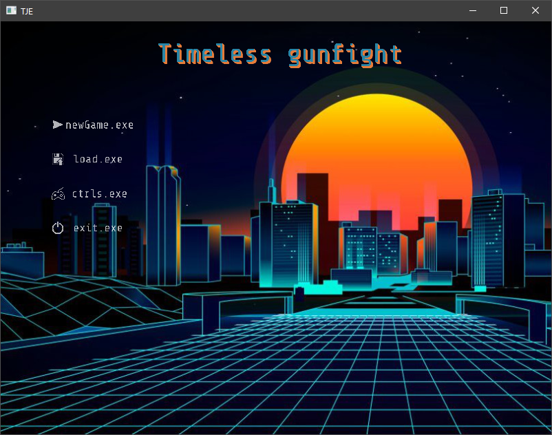
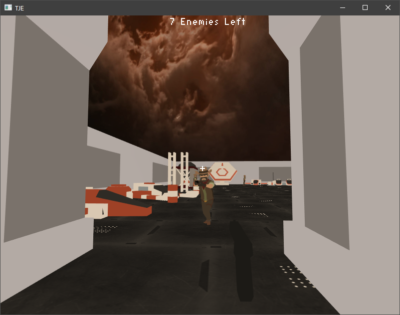
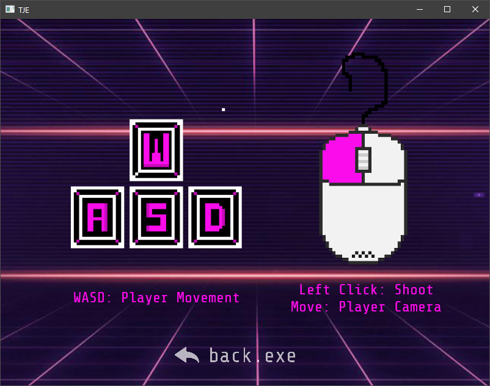
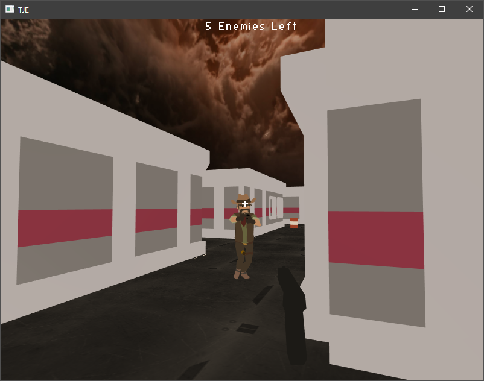
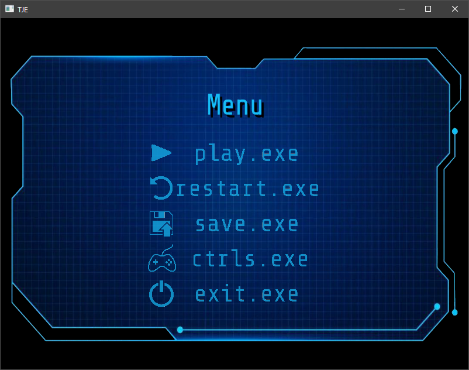

# TIMELESS GUNFIGHT 
Juego 3D creado por Bosco Olives & Josep Ricci para la asignatura de 'Jocs Electrònics' de la Universidad Pompeu Fabra.

Juego de supervivencia, shooter y completar niveles.
Nuestro protagonista es un cowboy del espacio, encargado de salir con vida de una futurista estación espacial.
- En cada una existen múltiples enemigos, que al entrar en su rango de visión, te empiezan a seguir y dispararte de forma ilimitada,
- El objetivo consiste en derrotar a todos los enemigos en cada pantalla.
- La peculiaridad es que al no moverte, el tiempo se ralentiza, dando tiempo así a esquivar sus balas y pensar en tus próximos movimientos.

Breve video-gameplay:
https://youtu.be/Fdyf2nsNjMQ

Inspirado en el famoso juego SUPER HOT.

## Contenido
La carpeta /*src* contiene todas las clases necesarias para ejecutar y compilar el proyecto.
Existen clases enteras desarrolladas por Javi Agenjo (a modo de framework base para crear el juego).
Clases empezadas por el profesor y terminadas por los dos alumnos.
Y clases íntegramente creadas por los dos alumnos para llevar a cabo funcionalidades deseadas del juego.

La carpeta /*data* contiene todos los recursos audiovisuales del juego (audios, imágenes, fondos, meshes...), también contiene la carpeta donde se almacenan las partidas guardadas (saves).

## SCREENSHOTS

Este proyecto ha sido desarrollado en 2 meses, siendo la primera vez que ambos alumnos creaban un juego 3D, y la segunda vez en la asignatura en desarrollar un juego (anteriormente un proyecto en 2D).
